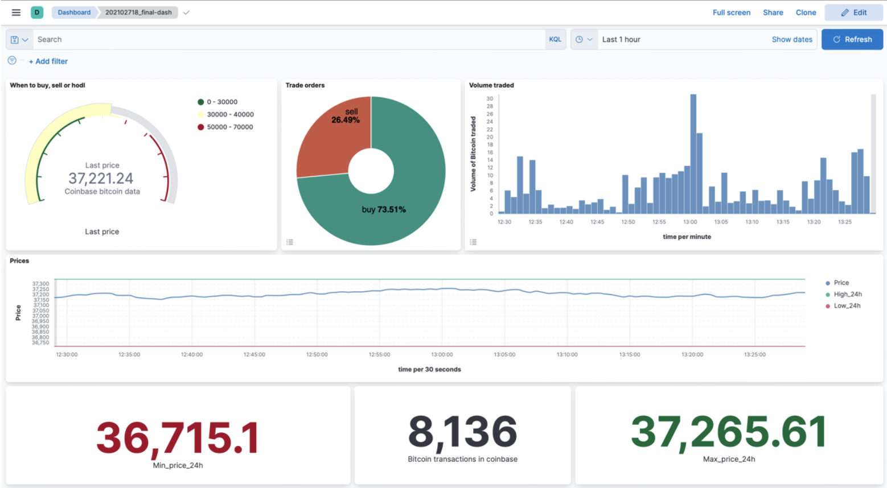

# Portfolio of projects

This repository contains a collection of projects developed by me over the years. Each project showcases different skills and techniques in machine learning, data analysis, and software development.

## Contact 
- [Linkedin](https://www.linkedin.com/in/santiago-arenas-martin/)
- [GitHub](https://github.com/SantiagoArenas)
- arenassanti2003@gmail.com

## Projects

1. **[Real-time Data Visualization](Real-time_Data_Visualization/Coinbase.ipynb)** 
    - Description: Acquiring data from the Coinbase crypto API, process it and upload to ElasticSearch where that data can be interpreted in a dashboard.
    - Technologies: Python, Kibana, ElasticSearch.

2. **[Machine Learning](Machine_Learning)** 
    - Description: Predicting the cost of different housing options in Austin, Texas, with multiple models, and comparing results.
    - Technologies: Python, Decision Trees, Boosting, MLR, NN, Random Forest, SMOTE, SkLearn.
    - A final report of the project can be found in the folder. All the visualizations for pre-modelling are availeable there as well.

3. **[Web Design/API Interaction](https://github.com/SantiagoArenas/FinalProjectTAP)** 
    - Description: Creating a new and potentially useful Web Application from scratch, using SpringBoot and Maven.
    - Technologies: Java, SpringBoot, Maven.
    - The project's repository is in the following link. There is another README availeable for more information.

4. **[C/Microprocessors](C)** 
    - Description: A functioning chess board made with a microprocessor, six switches, a TFG screen and a Bluetooth transmitter.
    - Technologies: C, UART, Assembling.
    - The final report is availeable in the repository. Here is a [video demo of the result](https://drive.google.com/file/d/1LYFAY7hxjtgApthc-28HQb5enJLajtjB/view?pli=1), although it is spoken in Spanish.   

I have completed more projects on each of the previously mentioned areas. Feel free to explore these projects and reach out if you have any questions or need further information. 

Cheers!

Santiago.